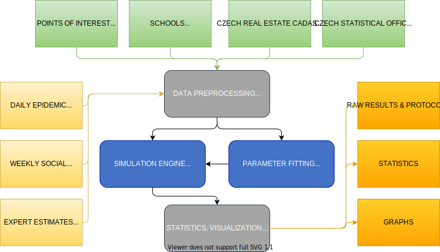
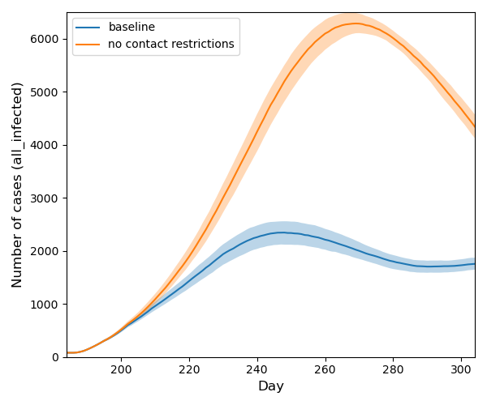
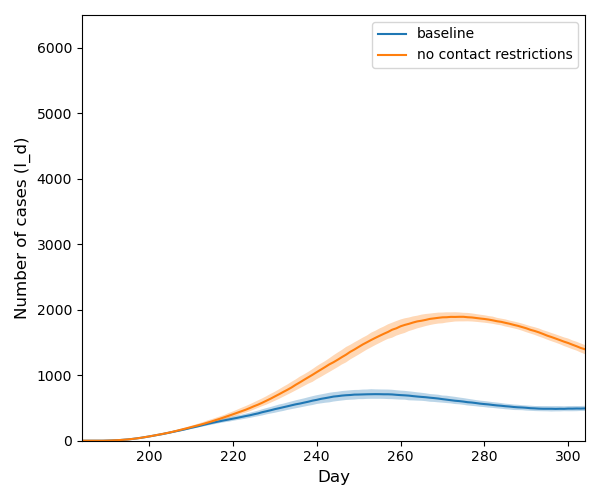

# Epicity &ndash; Model M

Model M is an agent-based epidemic model for COVID-19 computational experiments on realistic multi-graph social
networks. It allows to simulate projections of main epidemic indicators with respect to various interventions. These
include lockdowns, closures of different contact layers (leisure, schools, etc.), social distancing, testing and
quarantine, contact tracing, and vaccination.

<!--- PDF BREAK -->

#### Model M schema



For technical details see the [model documentation](doc/model.md).

## Authors

<details>
<summary>click to expand</summary>

**Luděk Berec**, *The Czech Academy of Sciences, Institute of Information Theory and Automation*, *Centre for
Mathematical Biology, Institute of Mathematics, Faculty of Science, University of South Bohemia and Czech Academy of
Sciences, Biology Centre, Institute of Entomology*&nbsp;<sup>3</sup> <br>
**Tomáš Diviák**, *The Czech Academy of Sciences, Institute of Information Theory and Automation*, *Department of
Criminology and Mitchell Centre for Social Network Analysis, School of Social Sciences, University of Manchester* <sup>
3</sup> <br>
**Aleš Kuběna**, *The Czech Academy of Sciences, Institute of Information Theory and Automation*&nbsp;<sup>3</sup> <br>
**René Levinský**, *CERGE-EI*&nbsp;<sup>3</sup> <br>
**Roman Neruda**, *The Czech Academy of Sciences, Institute of Computer Science*&nbsp;<sup>3</sup> <br>
**Gabriela Suchopárová**, *The Czech Academy of Sciences, Institute of Computer Science*&nbsp;<sup>3</sup> <br>
**Josef Šlerka**, *The Czech Academy of Sciences, Institute of Information Theory and Automation*, *New Media Studies,
Faculty of Arts, Charles University*&nbsp;<sup>3</sup> <br>
**Martin Šmíd**, *The Czech Academy of Sciences, Institute of Information Theory and Automation*&nbsp;<sup>3</sup> <br>
**Jan Trnka**, *The Czech Academy of Sciences, Institute of Information Theory and Automation*, *Department of
Biochemistry, Cell and Molecular Biology, Third Faculty of Medicine, Charles University*&nbsp;<sup>3</sup> <br>
**Vít Tuček**, *The Czech Academy of Sciences, Institute of Computer Science*, *Department of Mathematics, University of
Zagreb*&nbsp;<sup>3</sup> <br>
**Petra Vidnerová**, *The Czech Academy of Sciences, Institute of Computer Science*&nbsp;<sup>3</sup> <br>
**Karel Vrbenský**, *The Czech Academy of Sciences, Institute of Information Theory and Automation*&nbsp;<sup>
3</sup> <br>
**Milan Zajíček**, *The Czech Academy of Sciences, Institute of Information Theory and Automation*&nbsp;<sup>
3</sup> <br>
**František Zapletal**, *The Czech Academy of Sciences, Institute of Information Theory and Automation* <br>

<sup>3</sup> Centre for Modelling of Biological and Social Processes
</details>

## Examples of Simulation Results

Please follow the links to find out more details about the examples presented.

+ [Demo](doc/demo.md) <br>
  Some simple examples that present a good starting point for testing this software.

+ [Comparison of different contact tracing levels](doc/experiment1.md) <br>
  Study of different contact tracing level impacts.
  <table>
    <tr>
      <td><a href="doc/experiment1.md"></a></td>	
      <td><a href="doc/experiment1.md"></a></td>
    </tr>
  </table>

+ [Comparison of scenarios with closures and without closures](doc/experiment2.md)<br>
  Case study of contacts reduction.
  <table>
    <tr>
      <td><a href="doc/experiment2.md"></a></td>	
      <td><a href="doc/experiment2.md"></a></td>
    </tr>
  </table>

# Installation

All the requirements can be installed using [conda](https://docs.conda.io/en/latest/):

```console
conda create -n mgraph python=3.8 -y
conda activate mgraph
conda install --file requirements_conda.txt -y
python -m pip install -r requirements.txt
```

For other options and/or more help please refer to the [installation instructions](doc/installation.md).

# Usage

All the executable scripts are located in the [scripts](scripts) subfolder. So first of all run:

```console
cd scripts
```

Most of the following commands take as a parameter the name of an INI file. The INI file describes all the configuration
settings and locations of other files used. Please refer to [INI file specification](doc/inifile.md) for details.

There are several INIs provided so that you can base your experiments on these settings:

|filename|description|
|---|---|
|[demo.ini](config/demo.ini)&nbsp;<sup>1</sup>| Very small region (5k inhabitants) for demonstration purposes.|
|[papertown.ini](config/papertown.ini)&nbsp;<sup>2</sup>| Hodoninsko region as referred in paper [[preprint](https://doi.org/10.1101/2021.05.13.21257139)]|
|[hodoninsko.ini](config/hodoninsko.ini)| Hodonínsko region (57k persons)|
|[lounsko.ini](config/lounsko.ini)| Lounsko region (42k persons)|

<sup>1</sup> All the intermediate outputs of all scripts for `demo.ini` are included in this repository. Therefore you do not
need to run the scripts in the described order.

<sup>2</sup> Graph files of `papertown.ini` are included in this repository. It is not possible to generate this graph
from scratch again by `generate.py` script since several non-public data sources were used for its creation. This graph
was used for experiments presented in our preprints.

### 1. Generation of a graph

Unless you use `papertown` or `demo` graph that are included in this repository, you have to generate your graph. For example:

```console
python generate.py ../config/hodoninsko.ini 
```

would generate a m-graph for Hodonínsko region. For further information please refer to the documentation of
the [generate](doc/generate.md) command.

### 2. Running your experiments

Run your experiment. Note that the first time you run it, the graph is loaded from CSV files, which takes several minutes.

+ If you wish to run one simulation only, use `run_experiment.py`:

```console
python run_experiment.py -r ../config/hodoninsko.ini my_experiment
```

After the run finishes, you should find the file `history_my_experiment.csv` in the directory specified as `output_dir`
in your [INI file](doc/inifile.md#task). The INI files provided use `data/output/model` directory.

+ For a proper experiment, you should evaluate the model more times. You can do it in parallel using:

```console
python run_multi_experiment.py -R ../config/random_seeds.txt --n_repeat=100 --n_jobs=4 ../config/hodoninsko.ini my_experiment
```

By default it produces a ZIP file with the resulting history files. You can change `output_type` to FEATHER and the result
will be stored as one data frame in the feather format. The resulting file is stored in the directory specified
by `output_dir` and it is named `history_my_experiment.zip` or `history_my_experiment.feather`.

### 3. Result visualisation

Now you can create a plot from the resulting files and save it to the path specified by `--out_file PATH_TO_IMG`.

```console
python plot_experiments.py ../data/output/model/history_my_experiment.zip --out_file ./example_img.png
```

<!--- PDF BREAK --><!--- PDF BREAK -->

## Configuration and Advanced Features

Please consult [How to run simulations](doc/run.md) for options of individual scripts,
[INI file specification](doc/inifile.md), and [How to fit the paremeters](doc/run.md#6-fitting-your-model).

## Acknowledgement

We would like to thank the company Seznam.cz, a.s., division Firmy.cz who provided us with the source data for model
creation (points of interests) free of charge.

The work has been supported by the "City for People, Not for Virus" project No. TL04000282 of the Technology Agency of
the Czech Republic.

## How to cite

If you would like to refer to this software in a publication, please cite the following paper preprint on medrXiv:

Model-M: An agent-based epidemic model of a middle-sized municipality <br>
Ludek Berec, Tomas Diviak, Ales Kubena, Rene Levinsky, Roman Neruda, Gabriela Suchoparova, Josef Slerka, Martin Smid,
Jan Trnka, Vit Tucek, Petra Vidnerova, Milan Zajicek, Frantisek Zapletal <br>
medRxiv 2021.05.13.21257139; doi: https://doi.org/10.1101/2021.05.13.21257139

<pre>
@article {Berec2021.05.13.21257139,
	author = {Berec, Ludek and Diviak, Tomas and Kubena, Ales and Levinsky, Rene 
  and Neruda, Roman and Suchoparova, Gabriela and Slerka, Josef and Smid,  Martin
  and Trnka, Jan and Tucek, Vit and Vidnerova, Petra and Zajicek, Milan 
  and Zapletal, Frantisek},
	title = {Model-M: An agent-based epidemic model of a middle-sized municipality},
	elocation-id = {2021.05.13.21257139},
	year = {2021},
	doi = {10.1101/2021.05.13.21257139},
	publisher = {Cold Spring Harbor Laboratory Press},
	URL = {https://www.medrxiv.org/content/10.1101/2021.05.13.21257139v1},
	eprint = {https://www.medrxiv.org/content/10.1101/2021.05.13.21257139v1.full.pdf},
	journal = {medRxiv}
}
</pre>
