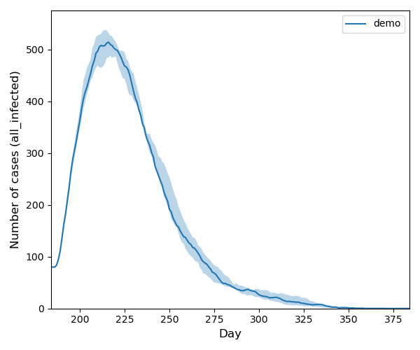
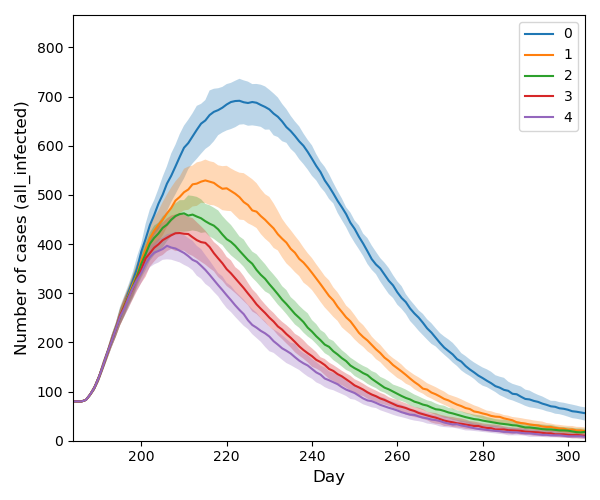

# Demo

If you just want to try the software and do not want to type all the commands, there is a short demo script prepared for
you. It uses [demo.ini](../config/demo.ini), i.e. runs on a very small graph (5k nodes).
Run [demo.sh](../scripts/demo.sh) in `scripts` folder

```
cd scripts
sh demo.sh
``` 

This fast example runs 10 simulations and produces the figure `demo.png`.



For a little more sophisticated example, comparing different levels of contact tracing, you can
run  [demo_tracing.sh](../scripts/demo_tracing.sh):

```
sh demo_tracing.sh
``` 

It evaluates 100 simulations for each of 5 scenarios (0 for no contact tracing, 1 the weakest contact tracing, 5 the
strongest contact tracing). You can find the result in the figure `demo_tracing.png`.


