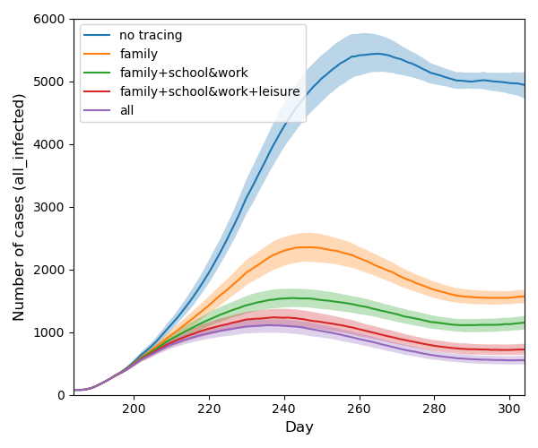
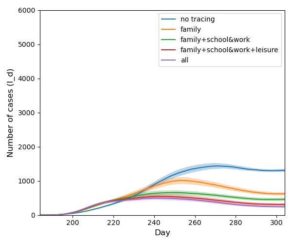

# Comparison of Different Contact Tracing Levels

The contact tracing policy distinguishes 4 levels of contacts

- family
- school \& work
- lesuire
- and others.

In this example experiment we compare 5 scenarios with the same setup but different levels of contact tracing.

They are:

0. no contact tracing
1. tracing of family contacts only
2. tracing family and school \& work contacts
3. tracing all contacts except others
4. tracing all contacts

The following figures show the active cases. We can see that even the tracing of *family only* contacts reduces the
number of infected individuals significantly. The right-hand side figure plots the number of detected individuals. We
can notice that the number of detected individuals initially rises much slower in the case of no tracing comparing to
other scenarios that perform much more tests. But later on the number of detected cases becomes the worst anyway since
the epidemic in this case is really significant.

<table>
<tr>
  <td></td>
  <td></td>
  </tr>
  <tr> 
    <td> Infected individuals </td>
    <td> Detected individuals </td>
  </tr>
</table>  

If you want to reproduce the experiment on your computer, you can
run [example_experiment.sh](../scripts/example_experiment.sh).

```
cd scripts
sh example_experiment.sh 
```

Please note that running this command might take up to several hours depending on your hardware.

