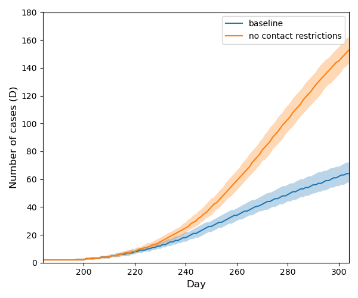

# Comparison of Scenarios With Closures and Without Closures

The baseline setup of this experiment roughly approximates the autumn 2020 situation in the Czech Republic. The second
setup for comparison removes all the nationwide closures.

The results are demonstrated in the following figures. We can see that the contact restrictions are rather strong
resulting in much lower numbers of infected individuals.

<table>
<tr>
  <td></td>
  <td> </td>
  </tr> 
  <tr> 
    <td>Infected individuals (active cases)</td>
    <td>Detected individuals (active cases)</td>
  </tr>
  <tr>
    <td></td>
    <td></td>
  </tr>
  <tr>
    <td>Dead individuals</td> <td></td>
  </tr> 
</table> 

You can reproduce the experiment by running [example_experiment2.sh](../scripts/example_experiment2.sh).

```
cd scripts
sh example_experiment2.sh 
```
