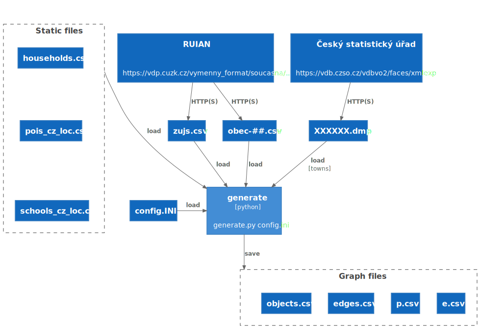

# generate

The `generate` script is used for generation of an m-graph.

```
Usage: generate.py [OPTIONS] <filename.ini>

  Generates graph files.

Options:
  -s, --set <KEY> <VALUE>  set config value
  --help                   Show this message and exit.
```

The required parameter is a name of INI file to be used. Furthermore all the parameters in the `GEN_GRAPH` section can
be overriden using the optional `-s` parameter.

The `generate` script uses sections [GRAPH](inifile.md#graph) and [GRAPH_GEN](inifile.md#graph-gen). As a minimum the
ini file should contain a definition of a region to be generated (parameters towns_ob or towns_orp) and the name
parameter. Use `towns_ob` (list of ZUJ's to be included) and/or `towns_orp` (list of ORP's to be included). The
graph `CSV` files will be created or overwritten. The filenames of generated CSV files are defined in the GRAPH section.
Typically, these files are stored in subdirectories of `data/m-input/`.

Refer to [hodoninsko.ini](../config/hodoninsko.ini) as a working example.

The following diagram describes the basic data flow while generating a graph.



