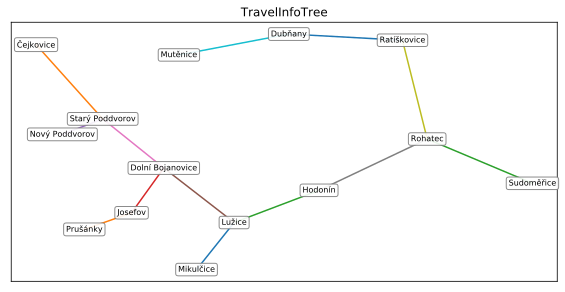
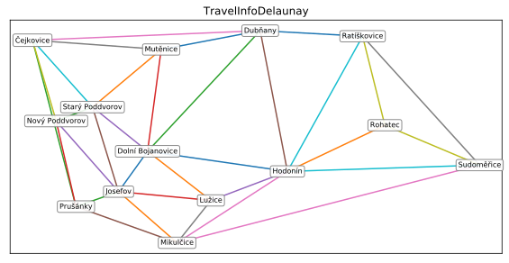
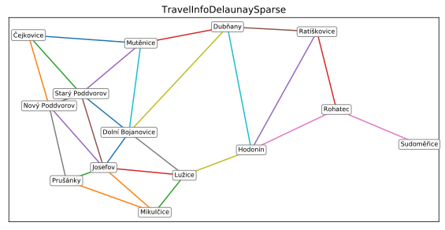
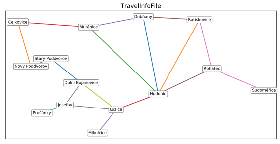

# `TRAVEL_INFO` parameter
This parameter defines how the travelling network will be generated.

#### `TravelInfoTree`
A tree as automatically generated based on the distances between towns and their sizes.

#### `TravelInfoDelaunay`
Travel network is generated from Delaunay triangulation.

#### `TravelInfoDelaunaySparse`
Travel network is generated from Delaunay triangulation. But redundant connections are omitted (travelling through other node is not significantly longer).
This is the recomended option when you do not have explicitly defined your travelling network. 

#### `TravelInfoFile`
Traveling network is fully explicitly defined in csv file. By default the travel network is define by file `<BASE_DIR>/config/gen_graph/<NAME>_transport.csv`

